.. _lab1:

.. title:: Deployment Services

.. note::

	Due to Covid-19, Remote Installations are now being done with the majority of our customers.  This can be done in a few ways.  The remote installation workflow is different but can be simplified by manually setting the node IPs.  Because manually setting the node IPs covers a much broader situations we will be focusing on these stepsin the Labs.  Rack and stack and setting the IPMI IPs via BIOS or ipmitool commandwill have to be done by someone ahead of timein order for you to have access to these systemsremotely.Note: Theremote installation steps are also used for node models that do not have 1Gb portsor dark sites.

.. Remote Console
.. +++++++++++++++
..
.. #. Open a web browser to your IPMI IP: ``http://<IPMI IP>`` USE YOUR ASSIGNED NODE(S)
..
..    - User: ADMIN
..    - Password :ADMIN
..
.. #. Click Remote Console
..
..    .. image:: images/ncsc-1.png
..
.. #. Click iKVM/HTML5 to get to the console of the node (AHV)
..
.. #. Login with your AHV Host “root” user lab assigned password
..
.. #. To login to the local CVM use the internal IP
..
..    .. code-block:: bash
..
..       ssh nutanix@192.168.5.2
..
.. #. Login with your CVM lab assigned password
..
.. #. From **NODE A** only, for team labs only one person should do this step) Since these labs are provided already installed, we want to put the system into a similar state to when they are out of the factory.  To do so run the following commands:
..
..    .. code-block:: bash
..
..       cluster status # shows you the status of your cluster. In our lab the cluster is UP
..       cluster stop # this will disable the cluster
..
..    .. note::
..
..     If VMs are online you must shut them down use the following commands:
..
..     .. code-block:: bash
..
..         acli vm_list  #gets the list of vms
..         acli vm.force_off <name of VM> #forcefully shuts down VM
..
.. #. Execute the following command to destroy the cluster configurations – removes all CVM's services from the cluster. This is to put our labs in out of factory state.
..
..    .. code-block:: bash
..
..     cluster destroy
..
..    .. note::
..
..     This is destructive to existing production data.  You would not want to do this command unless you are prepared to lose your data still on a cluster.
..
.. #. Run the command to confirm if the Cluster is currently unconfigured
..
..    .. code-block:: bash
..
..     cluster status
..     exit # to exit the CVM and go back to AHV prompt for next lab
..
..    .. note::
..
..     If cluster completes and still showing as still part of a cluster you can manually set  it on each node individually with the following commands:
..
..     .. code-block:: bash
..
..      cd /homes/nutanix
..      touch .node_unconfigure
..      genesis restart

.. Crashcart Tool
.. ++++++++++++++++++++++++++++++
..
.. In a remote install or deployment the IPMI was set ahead of time for remote access this command will now be use to set the HOST and CVM IP as well as Network settings.
..
.. #. Continued from the previous console we can run the following commands:
..
..    .. code-block:: bash
..
..     cp ~/firstboot/fc_progress.py ~/nutanix-network-crashcart/” # This file is missing in the crashcart path and has been fixed in future releases 5.16.1+
..     cd /root/nutanix-network-crashcart/”  # change directory to crashcart folder
..     ./network_configuration” # opens up Nutanix Network Configuration
..
.. #. Note the network changes available to you on this local system
..
..    .. image:: images/ncsc-2.png
..
.. #. For this lab let’s choose “Cancel” as the IPs are already set
..
.. #. You can now “exit” and close your remote console

.. Foundation on CVM
.. ++++++++++++++++++++++++++++++
..
.. #. Open a web browser to your CVM IP: ``http://<CVM IP:8000>``  use your assigned CVM's IP
..
.. #. In Page 1, Start fill form with your Assigned lab Network IP settings provided and hit **Next**
..
.. #. In Page 2, Nodes section, notice that your remaining nodes are detected.  As they are previously configured the IPs autofilled but normally out of factory they will require you put your desired IPs.  **ONLY SELECT YOUR NODE IN THIS LAB**
..
.. #. We will be making a single node cluster.  Give it a Host name of ``HOST-<initials>``
..
.. #. On Page 3. Cluster page, let’s choose to **Skip automatic cluster formation** and give it 24GB of memory and hit **Next**.
..
..    .. note::
..
..   	 Only a select few models are supported in Single-node cluster in foundation we will use **Skip** and do this manually since we do not have any single node models in the labs.
..
.. #. On Page 4. AOS we will keep the default factory imaged software “we will skip AOS installation” and hit **Next**
..
.. #. On Page 5. Hypervisor same as previous step we will skip re-imaging and hit **Next**
..
.. #. On Page 6. IPMI only on bare-metal installation you would you need this step.  When using the factory image we can skip this and hit **Start**
..
.. #. Explore Logs to see live scripts running from Foundation
..
..    .. note::
..
.. 	  Estimated time 1-5 minutes to complete
..
.. #. We will now bring up your node as a single node cluster
..
.. #. Login to CVM again via SSH and run the following command:
..
..    .. code-block:: bash
..
..      cluster -s <cvm_ip> --cluster_function_list=one_node_cluster create
..
.. #. When completed, open a web browser to CVM IP: ``http://<Cluster_IP>``
..
.. #. Use the following user name and password provided in the lab.  (You may change the password to one you’d like to use)
..
..    - User: admin
..    - Password: Nutanix/4u

---------------------
Foundation
---------------------

Overview
++++++++

.. note::

  Estimated time to complete: **60 Minutes**

Foundation is used to automate the installation of the hypervisor and Controller VM on one or more nodes.
In this exercise you will practice imaging a physical cluster with Foundation. In order to keep the lab self-contained, you will create a single node "cluster" on which you will deploy your Foundation VM. That Foundation instance will be used to image and create a cluster from the remaining 3 nodes in the Block.

* In following steps, you may replace xx with your assigned cluster ID

DIY Your Environment
++++++++++++++++++++++++

A Hosted POC reservation provides a fully imaged cluster consisting of 4 nodes. To keep the lab self-contained within a single, physical block, you will:

- Destroy the existing cluster
- Create a single node "cluster" using Node D
- Install the Foundation VM on Node D
- Use Foundation to image Nodes A, B, and C and create a 3 node cluster

Using an SSH client, connect to the **Node A CVM IP** <10.42.xx.29> in your assigned block using the following credentials:

- **Username** - nutanix
- **Password** - *ask instructor*

.. code-block:: bash

  ssh nutanix@10.42.xx.29          # password: techX2019!

Execute the following commands to power off any running VMs on the cluster, stop cluster services, and destroy the existing cluster:

.. code-block:: bash

  cluster stop        # Enter 'Y' when prompted to proceed
  cluster destroy     # Enter 'Y' when prompted to proceed

Create Node D Cluster
+++++++++++++++++++++

Remaining in SSH client, access Node-D CVM and execute following commands

.. code-block:: bash

 ssh nutanix@10.42.xx.32           # password: techX2019!
 cluster -s 10.42.xx.32 create       # Enter 'Y' when prompted to proceed

 ncli cluster edit-params new-name=POCxx-D
 ncli cluster add-to-name-servers servers=10.42.196.10
 ncli user reset-password user-name='admin' password=techX2019!

.. note::

  The above command will create a "cluster" from a single node using RF1, offering no redundancy to recover from hardware failure. This configuration is being used for non-production, instructional purposes and should **NEVER** be used for a customer deployment.

  After the "cluster" is created, Prism will reflect Critical Health status due to lack of redundancy.

Install Foundation VM
++++++++++++++++++++++

Open \https://*<Node D CVM IP>*:9440 (\https://10.42.xx.32:9440) in your browser and log in with the following credentials:

- **Username** - admin
- **Password** - techX2019!

Accept the EULA and Pulse prompts.

In **Prism > Storage > Table > Storage Pool**, select default storage pool and click update, then rename it to *SP01*

Check if there is a container named *Images*, if not, Click **+ Storage Container** to create a new container named *Images*

.. image:: images/image001.png

Go to configuration page and navigate to **Image Configuration**, click **+Upload Image**
Fill out the following fields and click **Save**:

- **Name** - Foundation
- **Image Type** - Disk
- **Storage Container** Images
- Select **From URL**
- **Image Source** - https://ntnx-portal.s3.amazonaws.com/foundation/foundation-4.4.1/Foundation_VM-4.4.1-disk-0.qcow2

.. image:: images/image002.png

.. note::

  At the time of writing, Foundation 4.4.1 is the latest available version. The URL for the latest Foundation VM QCOW2 image can be downloaded from the `Nutanix Portal <https://portal.nutanix.com/#/page/foundation>`_.

  **Unless otherwise directed by support, always use the latest version of Foundation in field installation.**

Go to configuration page and navigate to **Network Config**.

Before creating the VM, we must first create a virtual network to assign to the Foundation VM. The network will use the Native VLAN assigned to the physical uplinks for all 4 nodes in the block.

Click **Virtual Networks > Create Network**.

Fill out the following fields and click **Save**:

- **Name** - Primary
- **VLAD ID** - 0

In **Prism > VM > Table** and click **+ Create VM**.

Fill out the following fields and click **Save**:

- **Name** - Foundation
- **vCPU(s)** - 2
- **Number of Cores per vCPU** - 1
- **Memory** - 8 GiB
- Select **+ Add New Disk**

  - **Operation** - Clone from Image Service
  - **Image** - Foundation
  - Select **Add**
- Select **Add New NIC**

  - **VLAN Name** - Primary
  - Select **Add**

.. image:: images/image003.png

.. image:: images/image004.png

.. image:: images/image005.png

Config Foundation VM
+++++++++++++++++++++

Select your **Foundation** VM and click **Power on**.

Once the VM has started, click **Launch Console**.

Once the VM has finished booting, click **nutanix**. Enter the default password ** click **Log In**.

.. image:: images/image006.png

Double-click **set_foundation_ip_address > Run in Terminal**.

Select **Device configuration** and press **Return**.

.. image:: images/image009.png

Select **eth0** and press **Return**.

.. image:: images/image010.png

.. note:: Use the arrow keys to navigate between menu items.

Replacing the octet(s) that correspond to your HPOC network, fill out the following fields, select **OK** and press **Return**:

- **Use DHCP** - Press **Space** to de-select
- **Static IP** - 10.42.xx.45 (Foundation VM IP)
- **Netmask** - 255.255.255.128
- **Gateway** - 10.42.xx.1
- **DNS** - 10.42.196.10

.. image:: images/image011.png
  :scale: 60%

.. note::

  The Foundation VM IP address should be in the same subnet as the target IP range for the CVM/hypervisor of the nodes being imaged. As Foundation is typically performed on a flat switch and not on a production network, the Foundation IP can generally be any IP in the target subnet that doesn't conflict with the CVM/hypervisor/IPMI IP of a targeted node.

Select **Save** and press **Return**.

.. image:: images/image012.png

Select **Save & Quit** and press **Return**.

.. image:: images/image013.png

Foundation Node ABC cluster
++++++++++++++++++++++++++++

By default, Foundation does not have any AOS or hypervisor images. You can download your desired AOS package from the `Nutanix Portal <https://portal.nutanix.com/#/page/releases/nosDetails>`_.

If downloading the AOS package within the Foundation VM, the .tar.gz package can also be moved to ~/foundation/nos rather than uploaded to Foundation through the web UI.

To shorten the lab time, we use command line to access foundation VM and download NOS binary to designated folder in it.

Open a terminal and ssh to foundation VM through foundation IP <10.42.xx.45>

.. code-block:: bash

 ssh nutanix@10.42.xx.45      # ask your instructor
 cd foundation
 cd nos
 wget  https://ntnx-portal.s3.amazonaws.com/releases/euphrates-5.10.5-stable/nutanix_installer_package-release-euphrates-5.10.5-stable.tar.gz
 ..

When you see 100% finish, AOS 5.10.5 package has been downloaded to ~/foundation/nos folder.

From within the Foundation VM console, launch **Nutanix Foundation** from the desktop.

Access foundation UI via any browser at \http://*<Foundation VM IP 10.42.xx.45>*:8000/gui/index.html

On the **Start** page, click **Next**.

- **network** – eth0
- **Select your hardware platform**: Autodetect
- **Netmask of Every Hypervisor and CVM** - 255.255.255.128
- **Gateway of Every IPMI** - 10.42.xx.1
- **Netmask of Every IPMI** - 255.255.255.128
- **Gateway of Every Hypervisor and CVM** - 10.42.xx.1

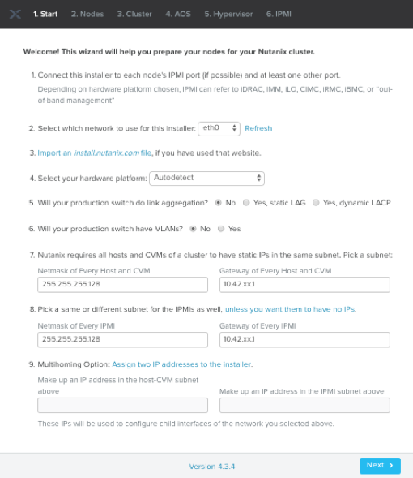

In new foundation page, clear all auto discovered nodes and click **add nodes manually**

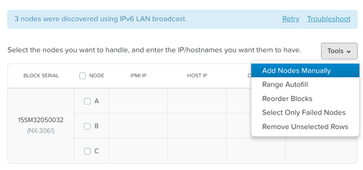

Fill in block information, choose **I will provide the IPMIs' MACs** and click **Add**

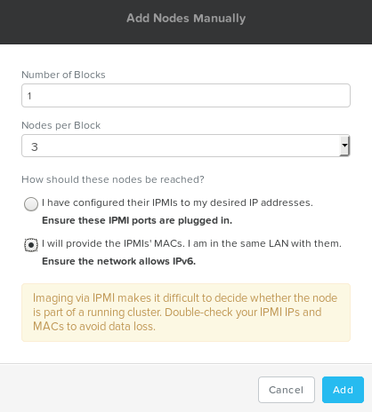

.. note::

 Foundation will automatically discover any hosts in the same IPv6 Link Local broadcast domain that is not already part of a cluster.

 When transferring POC assets in the field, it's not uncommon to receive a cluster that wasn't properly destroyed at the conclusion of the previous POC. In that case, the nodes are already part of existing clusters and will not be discovered.

 In this lab, we choose manually specify the MAC address instead in order to practice as the real world.

.. note::

 There are at least 2 methods to know MAC address remotely.

 Method.1 Identify MAC Address (BMC MAC address) of Nodes (A, B, C) by accessing IPMI IP for each node

 Method.2 Identify MAC Address of Nodes (A, B, C) by login AHV host with User: root, Password: *default* for each node

Access Node A IPMI through IP 10.42.xx.33 with ADMIN/ADMIN

.. image:: images/image101.png

.. image:: images/image102.png

Record your NODE A/B/C BMC MAC address ( in above example , it is **ac:1f:6b:1e:95:eb** )

Doing the same with your other 2 nodes B/C, access Node B and C IPMI through IP 10.42.xx.34/35 with ADMIN/ADMIN, record all 3 BMC MAC addresses.

Selecting NODE, click **Range Autofill** in drop-down list of **Tools**, replacing the octet(s) that correspond to your HPOC network, fill out the following fields and select **Next**:

- **IPMI MAC** - the three your just recorded down
- **IPMI IP** - 10.42.xx.33
- **Hypervisor IP** - 10.42.xx.25
- **CVM IP** - 10.42.xx.29
- **Node A Hypervisor Hostname** – POCxx-1

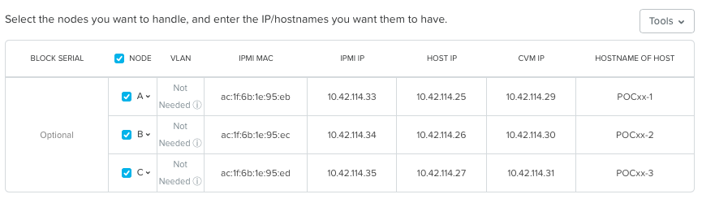

Replacing the octet(s) that correspond to your HPOC network, fill out the following fields and select **Next**:

Leave the first 2 options unselected, fill out the following fields and click **Next**:

- **Cluster Name** - POCxx-ABC
- **Timezone of Every Hypervisor and CVM** - *your local timezone*
- **Cluster Redundancy Factor** - 2
- **Cluster Virtual IP** - 10.42.xx.37

  *Cluster Virtual IP needs to be within the same subnet as the CVM/hypervisor.*

- **NTP Servers of Every Hypervisor and CVM** - 0.pool.ntp.org,0.au.pool.ntp.org,2.au.pool.ntp.org,0.sg.pool.ntp.org,1.sg.pool.ntp.org
- **DNS Servers of Every Hypervisor and CVM** - 10.42.196.10

  *DNS and NTP servers should be captured as part of install planning with the customer.*

- **vRAM Allocation for Every CVM, in Gigabytes** - 32

  *Refer to AOS Release Notes > Controller VM Memory Configurations for guidance on CVM Memory Allocation.*

To upload AOS or hypervisor files, click **Manage AOS Files**.

.. image:: images/image018.png

   Click **+ Add > Choose File**. Select your downloaded *nutanix_installer_package-release-\*.tar.gz* file and click **Upload**.

After the upload completes, click **Close**. Click **Next**.

Select **unless you want it** if it suggest you skip the AOS installaion process

Since we have already upload our desired AOS through command line, just select it and click **Next**

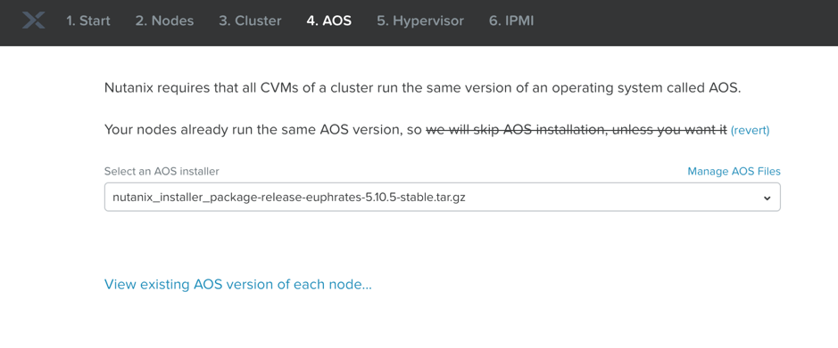

Fill out the following fields and click **Next**:

- **Select a hypervisor installer** - AHV, AHV installer bundled inside the AOS installer

.. image:: images/image020.png

.. note::

  Every AOS release contains a version of AHV bundled with that release.

Select **Fill with Nutanix defaults** from the **Tools** dropdown menu to populate the credentials used to access IPMI on each node.

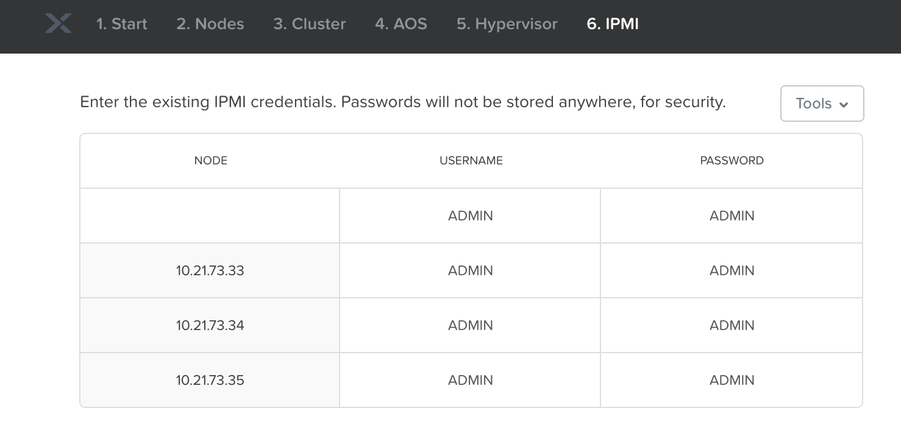

Click **Start > Proceed** and continue to monitor Foundation progress through the Foundation web console. Click the **Log** link to view the realtime log output from your node.

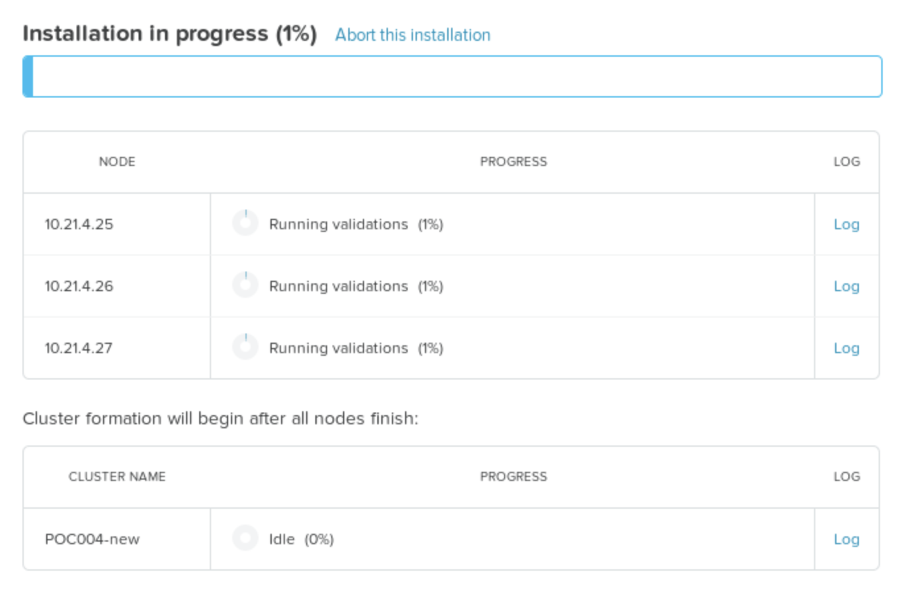

When all CVMs are ready, Foundation initiates the cluster creation process.

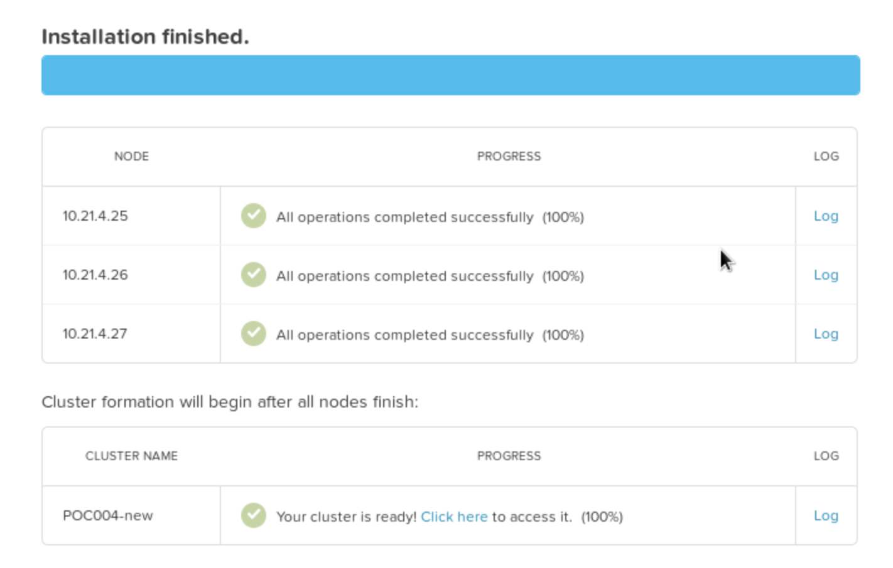

Open \https://*<Cluster Virtual IP >*:9440 (10.42.xx.37)in your browser and log in with the following credentials:

- **Username** - admin
- **Password** - *default*
- **Change the Password** - techX2019!

.. image:: images/image024.png

1-Click Upgrade
++++++++++++++++++++++++++++++

.. note::

	To determine the proper upgrade path from your current release to the target release, please check this link: https://portal.nutanix.com/#/page/upgradePaths

#. In Prism Element.  Click the Gear Icon again

#. Choose **Upgrade software**

   .. note::

    This will and detect online if there is a later version of the LTS or STS version of AOS currently running in the cluster.  If you want to go from change between LTS and STS you may have to up load the binaries manually.  IMPORTANT: To determine the proper upgrade path from your current release to the target release, please check this link: https://portal.nutanix.com/#/page/upgradePaths

#.	Download the required files.  To manually download the software files are available on http://portal.nutanix.com

#.	Click **Upgrade** then **Upgrade Now**

#.	Notice you can click **Close** and go to tasks and watch all the detailed tasks running in the background

.. Install Foundation VM
.. ++++++++++++++++++++++++++++++
..
.. .. note::
..
.. 	This is optional lab to do on your laptop
..
..   This is an important lab to understand bare-metal and we run through these steps with our Remote Labs due to network accessibility.   Use this lab as a reference lab.  When you would need to bare-metal or image a single node you will have to use Foundation VM or Portable Foundation.
..
.. Downloading the needed Foundation & AOS:
..
.. #.	Open a web browser and log in to the Nutanix Support portal: http://portal.nutanix.com
..
.. #.	Download Foundation VM
..
.. #.	You will also need to download an AOS/AHV bundle
..
.. #.	Extract Tar (7 zip) and import ``Foundation_VM-4.5.2.ovf`` file into VirtualBox
..
.. #.	Launch VM verify networking is bridged (See also Appendix files for further assistance with Oracle Virtual Box and VMware Workstation)
..
.. #.	Set the IP by clicking the set_foundation_ip_address Icon – use an IP within the CVM/Host network
..
.. #.	Use your laptop internet browser to browse to the IP set in previous step – IP on Laptop from the IP table (NOTE: Alternately You could use the icon “Nutanix Foundation” on the VM desktop but will have lower resolution and not be able to upload file from the browser from your laptop)
..
.. #.	Out of the factory you would see the nodes in the Discovery pane under the **2. Nodes** section.  If you are seeing discovered nodes you can skip the next step.  However in our labs the blocks most likely were not left in an “out of factory” state and you will need to do the BareMetal steps below
..
.. #.	To start bare-metal steps, click “Reach more nodes by manually entering the MAC Addresses.  You can get MAC from sticker on the back of each node.  The other option to use the IPMI IPs can be used if you are able to set those before Foundation the server.
..
.. .. note::
..
..   **Software Only** system will come with nothing pre-installed you must to use these bare-metal steps.  In the same fashion, you can not auto-discover any of your nodes if it is part of a cluster.

Prism Central Deploy
+++++++++++++++++++++

Open \https://*<POCxx-ABC Cluster IP>*:9440 (\https://10.42.xx.37:9440) in your browser and log in with the following credentials:

- **Username** - admin
- **Password** - *ask your instructor*

Navigate to **Home** page and click **Register or create new** in Prism Central widget.

.. figure:: images/1.png

Choose the first **Deploy** option.

.. figure:: images/2.png

Download the latest version and click **deploy 1-VM PC**

.. figure:: images/3.png

Fill out the following fields, leave others as default and click **Deploy**:

- **AHV Network** - Primary
- **IP Address** - 10.42.xx.39
- **Subnet Mask** - 255.255.255.128
- **Default Gateway** - 10.42.xx.1
- **DNS Address(Es)** - 10.42.196.10

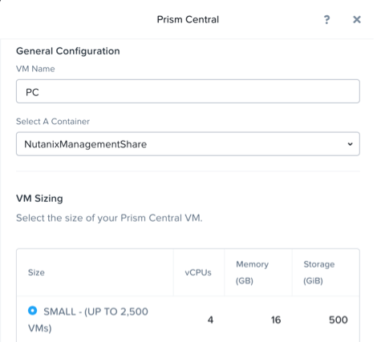

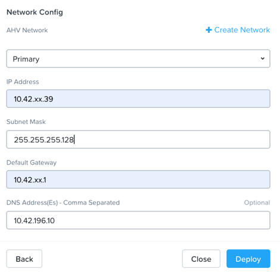

.. note::

After Prism Central VM is successfully deployed, open \https://*<PC VM IP>*:9440 (\https://10.42.xx.39:9440) in your browser and log in with the following credentials:

- **Username** - admin
- **Password** - default with capital N
- change password to **techX2019!**

Test if you can login Prism Central with the new password.

Prism Central Registration
+++++++++++++++++++++

Go back to POCxx-ABC Cluster  (\https://10.42.xx.37:9440), navigate to **Home** page and click cluster name **POCxx-ABC** and provide a cluster data service ip **10.42.xx.38**

.. figure:: images/9.png

Click **Register or create new** in Prism Central widget.

.. figure:: images/1.png

Choose the second **Connect** option.

.. figure:: images/2.png

Click **Next**

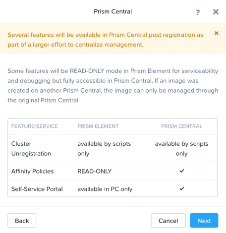

Fill out the following fields, leave others as default and click **Connect**:

- **Prism Central IP** - 10.42.xx.39
- **Port** - 9440
- **Username** - admin
- **Password** - techX2019!

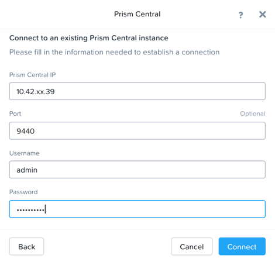

You will see an **OK** with PC's IP in Prism Central widget.

.. figure:: images/8.png

.. note::

  Prism Central's default password for admin *Nutanix/4u* must be changed before cluster registering PC

Create an As Built Guide
++++++++++++++++++++++++++++++

.. note::

	This is important lab after Nutanix cluster installation & configurations are completed. One of most important deliverables is the **As Built Guide** documentation.

#.	Copy and Extract the “As_Built_Documenter” from the Cluster Deployment Service Kit & Choose the appropriate script for your OS:

#.	Windows: Nutanix_Cluster_as_Built_Windows_v3.4.zip

#.	Mac: Nutanix_Cluster_as_Built_Mac_v3.4.zip

#.	Follow instructions from the README file and execute the binary. You will be prompted for cluster *username* and *password*.

#.  Change to the directory where the zip file is extracted.

    For Windows workstations:

    .. code-block:: PowerShell

      generate_document.exe -c "CompanyName, Inc." -n <Nutanix cluster IP>

    For Mac:

    .. code-block:: bash

      ./generate_document -c "CompanyName, Inc." -n <Nutanix cluster IP>

#.	Open the file generated and modify the highlighted areas using provide templates to complete your as built document

    .. note::

     Use your company document template if applicable – this would be if you are providing the installation service in behalf of your company
