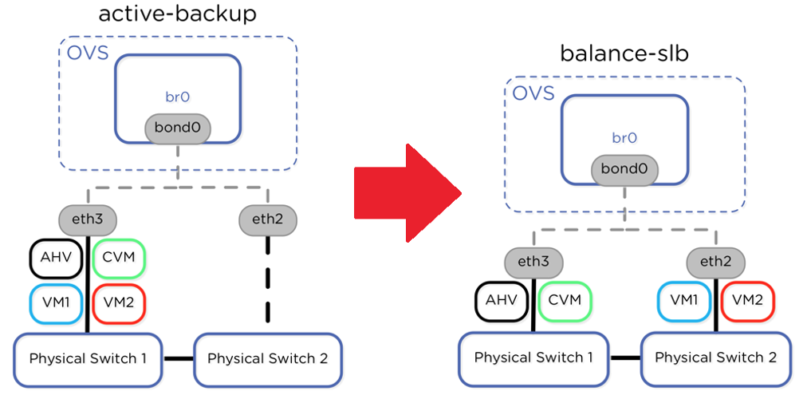

.. _lab2:

.. title:: Deployment Services

AHV Networking
+++++++++++++++

Changing Network Bond modes in AHV
-----------------------------------

In this lab we would like to show you what it takes to set your bonds from the default active-backup to balance-slb (active/passive to active/active)

Changing Bond from Active/backup to `balance-slb`
----------------------------------------------------------------------

#. ssh into one of your CVMs

   .. code-block:: bash

     ssh nutanix@CVM-IP

#. To show the bond mode of the host run the following command:

   .. code-block:: bash

    ssh root@192.168.5.1 "ovs-appctl bond/show br0-up"

   Notice the bond_mode should default to active-backup

#. Change the bond mode to balance-slb run the following command:

   .. code-block:: bash

    ssh root@192.168.5.1 "ovs-vsctl set port br0-up bond_mode=balance-slb"

#. Set the recommended rebalance-interval to 30 sec with the following command:

   .. code-block:: bash

    ssh root@192.168.5.1 "ovs-vsctl set port br0-up other_config:bond-rebalance-interval=30000"

#. Verify the proper bond mode again:

   .. code-block:: bash

    ssh root@192.168.5.1 "ovs-appctl bond/show br0-up"

   Notice the next rebalance should be less than 30000ms bond_mode should be balance-slb

#. Repeat steps 1-5 for the remaining CVMs in order to change all ports modes to balance-slb

   .. note::

     You can set the network mode on all AHV hosts from a single CVM using the ``hostssh`` command (note that the cluster services need to running for this command to work).

     See :ref:`command_reference` for hostssh usage instructions.

Setting the VLANs from command line (Optional Reference Lab)
-------------------------------------------------------------

.. note::

  This lab is important as you will need to change the VLANs when systems are in Trunked production networks this is the case with most production environments.

  It’s recommend connecting by remote console in IPMI because you may lose connection if you are SSH into the node.

#. Assign port br0 to the VLAN that you want the host be on.

   .. code-block:: bash

    root@ahv# ovs-vsctl set port br0 tag=host_vlan_tag #(w/VLAN tag for hosts.)

#. Confirm VLAN tagging on port br0.

   .. code-block:: bash

    root@ahv# ovs-vsctl list port br0

#. From host console Log on to the Controller VM.

   .. code-block:: bash

    root@ahv# ssh nutanix@192.168.5.254

#. Assign the public interface of the Controller VM to a VLAN.

   .. code-block:: bash

    nutanix@cvm$ change_cvm_vlan vlan_id #(w/VLAN tag for CVM)
